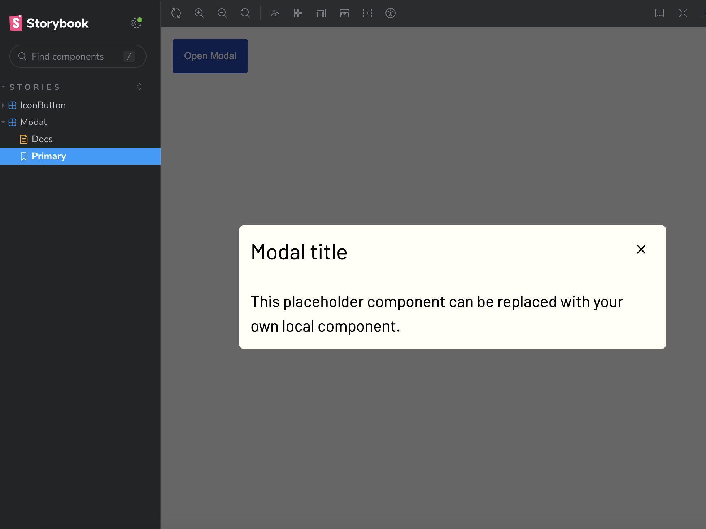

# Nando's Design System

This project was bootstrapped with [Create React App](https://github.com/facebook/create-react-app). 

## Installation

Clone the repository, then run

### `npm install`

This installs all the required dependencies.

## Usage

This application has been integrated with Storybook to view UI components in isolation. To start Storybook and see the available components, run

### `npm run storybook`

Open [http://localhost:6006](http://localhost:6006) to view it in the browser.

The page will reload if you make edits to the code.\
You will also see any lint errors in the console.

You can test each component in Storybook via their "Primary" versions.

Please refer to Docs to get information about how to use the component as well as code snippets.

### `npm test`

Launches the test runner in the interactive watch mode.\
See the section about [running tests](https://facebook.github.io/create-react-app/docs/running-tests) for more information.

## Future work

The primary component in this design system, the modal, can benefit from the following optimizations in the future:

1. A Focus Trap within the modal when it is open so that users do not tab out of the modal window. This is to ensure accessibility.

2. Improved Storybook documentation. At the moment, the auto-generated documentation for the Modal component in Storybook is buggy in terms of the rendered UI. 

3. Extract ModalHeader and ModalBody into separate components that developers can use to make the modal UI with much more flexibility. 

